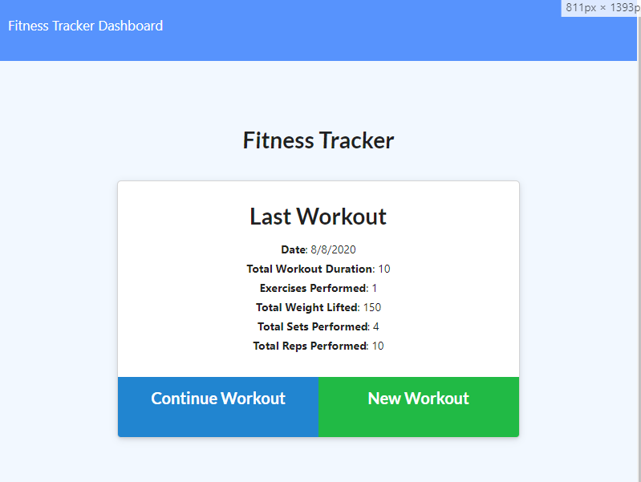
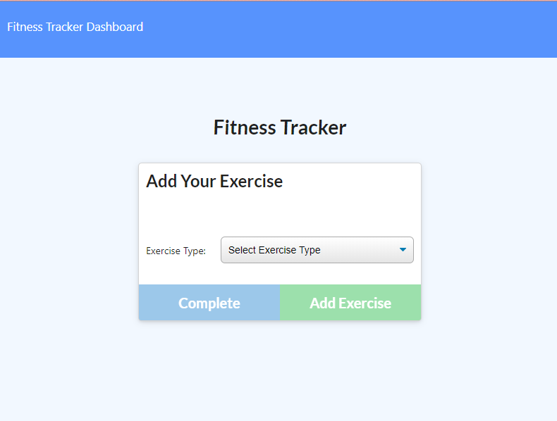
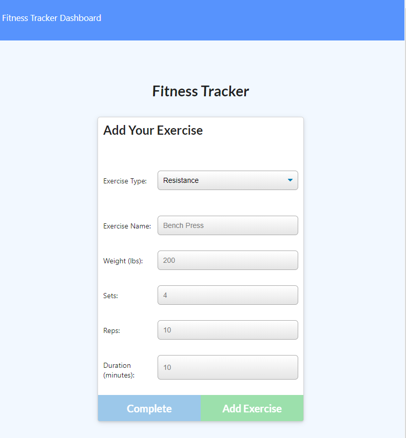
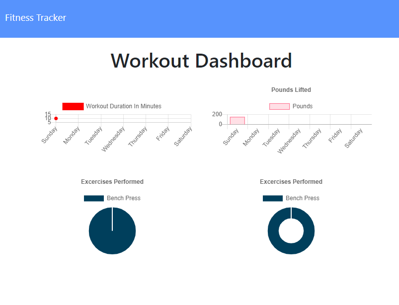

# Fitness-Tracker

## Description
This application lets users keep track of their exercises. Users can add workouts and display total performance/duration after adding their exercises. Users can display their statistics on a separate page.

## Usage
To use the deployed application, please visit [Fitness Tracker](https://fitnesstracker-application.herokuapp.com/). Here are the scenarios that user can achieve via the application.

1. When the user visit the application, a summary of last workout is displayed. User can add new workout or continue existing workout.  


2. Clicking on New Workout will display a form for user to type in details for the workout 


3. User can add exercises to the workout.


4. Finally, statistics can be displayed.


## Installation
1. Install mongodb and use seed.js file to populate with seed data
2. Run the commands to install dependencies and run the application locally:
```
npm i 
node server.js
```
3. Visit localhost:3001 and start interacting with the application

## Contributions
Contributions are welcome. Feel free to send your pull request!